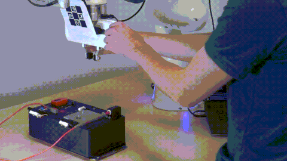

# ILeSiA: Interactive Learning of Situational Awareness from Camera Input

See the project website for the paper, materials, and more: http://imitrob.ciirc.cvut.cz/publications/ilesia/

Teaching robots how to use camera images to detect labeled and novel risks.
ILoSA is a framework that defines models regarding safety instruments used by robotic execution systems to evaluate safety metrics and potentionally provide ways to recover from risky situations.

The learning process consists of two steps:
1. Kinesthetic demonstration - in which the human leads the robot through the desired motion,
2. Risk observed & labeling - in which the human can stop the robot with a button which at the same time saves risky labels that are used in learning to improve risk estimation model during next skill execution.



ILeSiA has shown to be effective detecting different challenging risks, such as door opened, holding peg, peg in a hole, as well as observed user hands or unknown objects. Proper risk recognition requires a single demonstration of risk you want to detect. 

## Install 

Install dependencies: 
`pip install torch gpytorch` - model training
`pip install opencv-python scikit-video scikit-learn scikit-image` - image & data processing
`pip install pandas matplotlib seaborn` - plotting & saving
custom [confusion_matrix_pretty_print](https://github.com/petrvancjr/pretty-print-confusion-matrix) (install: `pip install .` inside downloaded repo)
`sudo apt-get install python-rospkg` - trajectory root folder search.

```Shell
cd <your_ws> # initialize ROS workspace
git clone https://github.com/platonics-delft/franka_impedance_controller # needs realtime kernel installed
git clone https://github.com/franzesegiovanni/franka_buttons # (optional to use franka buttons)
git clone https://github.com/platonics-delft/video-safety-layer/tree/ilesia
git clone https://github.com/platonics-delft/franka_risk_aware_learning_from_demonstrations
git clone https://github.com/platonics-delft/trajectory_data
catkin build
source <your_ws>/devel/setup.bash
```
Install as ROS1 noetic package.

If package is not found, install with pip: `cd video_safety_layer; pip install .`

## Risk estimation

Or use collection demonstration data for Robothon box Setup by downloading: `cd <your_ws>/src; git clone git@github.com:platonics-delft/trajectory_data.git --branch ra_tests`

### Train risks interactive usage

1. Record new demonstration
```Shell
roslaunch skills_manager record_skill.launch name_skill:=super_skill
```
2. Train video embeddings
```Shell
rosrun video_embedding train_video_embedder.py --video super_skill
```
3. Optionally view the reconstructed video
```Shell
rosrun risk_estimation play_labelled_video.py --video super_skill
```

4. Interactivelly catch some risks
```Shell
roslaunch skills_manager interactive_skill_risk_trainer.launch localize_box:=true name_skill:=super_skill risk_policy:=ContinueRiskPolicy
```
- Executes given skill
- Choose `risk_policy`: What to do when risk detected:
    - `ContinueRiskPolicy`: Do nothing, continue
    - `AbortRiskPolicy`: Stops the skill
    - `WaitForFeedbackRiskPolicy`: Waits for the user to give labels (`r` - risk or `t` - safe)
    - `RecoveryRiskPolicy`: Finds recovery policy - experimental
- Updates the `risk_estimation` model
- You can label with franka buttons (or keyboard)
- Saves the trajectory

### Demo day with Robothon Box 

Session can be downloaded from: https://drive.google.com/drive/folders/1WVcQc793BUqWMg50jX_HBbDTp3_sqpLX?usp=sharing
Extract `demo_day_09_24_trajectories_manipulation_demo404_augment_12_session.zip` trajectories to `src/trajectory_data/trajectory/`
Extract `demo_day_09_24_video_embedding_manipulation_demo404_augment_12_session.zip` trajectories to `src/video_safety_layer/video_embedding/saved_models/`
Extract `demo_day_09_24_risk_models_manipulation_demo404_augment_12_session.zip` trajectories to `src/video_safety_layer/video_embedding/saved_models/`
Uncut video: `00137.MTS`

#### Usage

1. Unlock robot & enable FCI
2. Panda controller
```shell
source <your_ws>/devel/setup.bash
roslaunch franka_impedance_controller cartesian_variable_impedance_controller.launch robot_ip:=<panda ip> load_gripper:=True
```
3. Enable use of franka button (optional)
```shell
source <your_ws>/devel/setup.bash
roslaunch franka_buttons read_buttons.launch robot_ip:=<panda ip> username:=<panda (desk)> password:=<panda (desk)>
```
4. Robothon box localizer
```shell
source <your_ws>/devel/setup.bash
roslaunch object_localization box_localization.launch template:=demo404
```
5. Main console:
```shell
source <your_ws>/devel/setup.bash
roslaunch skills_manager home.launch # move robot to home position
roslaunch skills_manager interactive_skill_risk_trainer.launch localize_box:=true name_skill:=peg_pick404 session:=manipulation_demo404_augment_12_session risk_policy:=ContinueRiskPolicy # or pick peg manually
roslaunch skills_manager interactive_skill_risk_trainer.launch localize_box:=true name_skill:=peg_door404  session:=manipulation_demo404_augment_12_session risk_policy:=RecoveryRiskPolicy # test risk estimator with this command
```


### Additional scripts

Evaluate risk estimation model:
```Shell
roslaunch skills_manager realtime_complient_risk_monitor.launch localize_box:=true name_skill:=super_skill
```
- Loads given skill
- Updates the `risk_estimation` model
- You can move the robot (complient) and see the risk prediction
- Press number `0-9` to move to 0% - 100% of skill's phase


If you're not happy with the labelling, label manually
```Shell
rosrun risk_estimation label_video_manually.py --video super_skill
```

Run risk benchmarks:
```Shell
rosrun risk_estimation test_final_benchmark.py
```
Examine benchmarks in your browser (`localhost:8000`) by running `http.server`: 
```Shell
python3 -m http.server --directory <your_ws>/src/video_safety_layer/risk_estimation/autogen/
```
Manual train and evaluate labelled demonstration data of given skill with:
```Shell
rosrun risk_estimation train_markovian_risk_classifier.py --skill_name super_skill
```

Examine all dataset images
```Shell
python3 view_dataset_images.py --video super_skill
```

Out-of-distribution check for Distance Risk Estimator: 
```Shell
python3 ood_check.py --video peg_door_trial_0 --video_test peg_door_trial_1
```

Compares $h_{test}$ with representation one $h_{repr}$
Out-of-distribution check for GP Risk Estimator
